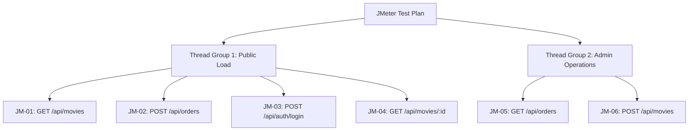

# MovieSphere Test Automation Suites – Detailed Code & Logic Walkthrough

This document provides an in-depth breakdown of the codebase, locator strategies, configuration paradigms, and assertions across all three test automation platforms implemented for **MovieSphere**:
1. **Selenium WebDriver (Java TestNG)**
2. **Cypress E2E (JavaScript)**
3. **Apache JMeter (REST API Load & Stress Testing)**

---

## 1. Selenium WebDriver Suite (Java TestNG)
**File Location:** [MovieStoreTest.java](file:///Users/chandan_dhumale/Desktop/movie-store/tests/selenium/java-maven/src/test/java/com/moviestore/MovieStoreTest.java)  
**Configuration File:** [pom.xml](file:///Users/chandan_dhumale/Desktop/movie-store/tests/selenium/java-maven/pom.xml)

The Selenium suite is a UI-based automation framework built on Java 17, Maven, TestNG, and WebDriverManager. It executes user actions inside Chrome and verifies DOM state updates using explicit waits.

### 1.1 Architecture & Setup Lifecycle
Selenium is managed by TestNG annotations that govern the lifecycle of each test case:
*   **`@BeforeMethod setUp()`**: Configures and initializes the ChromeDriver for each individual test.
    *   `WebDriverManager.chromedriver().setup()`: Automatically downloads and links the correct binary matching the local Google Chrome version.
    *   `ChromeOptions`: Sets arguments to run headlessly if the environment variable `HEADLESS=true` is set (critical for Jenkins running on headless servers), disables the sandbox, configures standard window sizes, and sets up page timeouts.
    *   `WebDriverWait wait = new WebDriverWait(driver, Duration.ofSeconds(10))`: Initializes explicit wait wrappers to avoid test flakiness from rendering delays.
*   **`@AfterMethod tearDown()`**: Quits the WebDriver session (`driver.quit()`) to free up memory and prevent orphaned browser processes on the machine.
*   **`pause(ms)` Helper**: Introduces manual sleep durations so observers can visually follow the actions during interactive executions.

---

### 1.2 Step-by-Step Test Logic Breakdown

#### SEL-01: Invalid Login Flow
*   **Purpose:** Verifies that attempting to authenticate with invalid credentials triggers appropriate UI error validation banners.
*   **Code Implementation:**
    ```java
    @Test
    public void testInvalidLoginFlow() {
        WebElement loginBtn = wait.until(ExpectedConditions.elementToBeClickable(By.id("login-btn")));
        loginBtn.click();
        
        wait.until(ExpectedConditions.visibilityOfElementLocated(By.id("login-dialog")));
        
        driver.findElement(By.id("login-email")).sendKeys("baduser@example.com");
        driver.findElement(By.id("login-password")).sendKeys("wrong_pass");
        driver.findElement(By.id("login-submit-btn")).click();
        
        WebElement errorMsg = wait.until(ExpectedConditions.visibilityOfElementLocated(By.id("login-error-msg")));
        assertTrue(errorMsg.getText().contains("Invalid email or password"),
                   "Expected error message was not shown!");
    }
    ```
*   **How it works:**
    1.  Waits for the login button (`#login-btn`) to be clickable in the navigation header, then clicks it.
    2.  Waits for the HTML5 `<dialog id="login-dialog">` element to transition to a visible state.
    3.  Locates form elements `#login-email` and `#login-password` by ID and types input.
    4.  Clicks the submit button (`#login-submit-btn`), sending a POST request from the client browser to the `/api/auth/login` backend route.
    5.  Waits for the backend to return a `401 Unauthorized` response, causing the React state to display the error alert block (`#login-error-msg`).
    6.  Asserts that the text content of the error matches the expected backend response message.

#### SEL-02: Admin Adds a New Movie
*   **Purpose:** Verifies that administrators can successfully create a new catalog listing and that it reflects dynamically on the store catalog homepage.
*   **Code Implementation:**
    ```java
    @Test
    public void testAdminAddMovieFlow() {
        // ... Login as Admin (admin@example.com / admin123) ...
        WebElement adminToggle = wait.until(ExpectedConditions.elementToBeClickable(By.id("admin-view-toggle")));
        adminToggle.click();
        
        wait.until(ExpectedConditions.visibilityOfElementLocated(By.xpath("//h1[contains(text(), 'Admin Control Center')]")));
        driver.findElement(By.id("admin-tab-movies")).click();
        
        String movieTitle = "Test Movie Java " + System.currentTimeMillis();
        driver.findElement(By.id("new-title")).sendKeys(movieTitle);
        driver.findElement(By.id("new-genre")).sendKeys("Drama");
        driver.findElement(By.id("new-year")).sendKeys("2026");
        driver.findElement(By.id("new-price")).sendKeys("9.99");
        driver.findElement(By.id("new-stock")).sendKeys("5");
        driver.findElement(By.id("new-desc")).sendKeys("A test description added dynamically by Java Selenium WebDriver.");
        driver.findElement(By.id("add-movie-submit")).click();
        
        WebElement successAlert = wait.until(ExpectedConditions.visibilityOfElementLocated(By.id("admin-success-msg")));
        assertTrue(successAlert.getText().contains("added successfully"));
        
        adminToggle.click(); // Toggle back to Shop view
        WebElement searchInput = wait.until(ExpectedConditions.visibilityOfElementLocated(By.id("movie-search-input")));
        searchInput.sendKeys(movieTitle);
        
        WebElement movieGrid = wait.until(ExpectedConditions.visibilityOfElementLocated(By.id("movie-grid")));
        assertTrue(movieGrid.getText().contains(movieTitle), "New movie was not found in the store!");
    }
    ```
*   **How it works:**
    1.  Logs in using admin credentials.
    2.  Locates `#admin-view-toggle` and clicks it to open the administrative route.
    3.  Uses an XPath locator `//h1[contains(text(), 'Admin Control Center')]` to assert the header is fully rendered.
    4.  Clicks the Movie Catalog Management tab (`#admin-tab-movies`).
    5.  Generates a unique string using JVM `System.currentTimeMillis()` to avoid name collisions in subsequent tests.
    6.  Populates the input forms (`#new-title`, `#new-genre`, etc.) and clicks `#add-movie-submit`.
    7.  Asserts that the success dialog `#admin-success-msg` indicates creation success.
    8.  Switches back to user view, enters the generated title into search, and asserts the created movie exists in the shop grid `#movie-grid`.

#### SEL-03: Catalog Search & Details Modal View
*   **Purpose:** Verifies store search query filtering and details modal open/close behaviors.
*   **Logic:**
    1.  Finds `#movie-search-input` and types `"Dune"`.
    2.  Asserts that the card grid content contains `"Dune: Part Two"` and does not contain `"Inception"`.
    3.  Clicks the CSS class `.movie-poster-wrapper` to trigger the React event list handler.
    4.  Asserts that the modal `#movie-details-dialog` is visible, and checks that `#dialog-title` is `"Dune: Part Two"`.
    5.  Clicks `#close-details-modal` and asserts that the dialog element is no longer visible.

#### SEL-04: Watchlist Quantity Management
*   **Purpose:** Validates cart sidebar quantity increments, decrements, and total price calculation.
*   **Logic:**
    1.  Selects the "Watch Now" button using a relative XPath locating strategy that targets the "Inception" movie card wrapper:  
        `//div[contains(@class, 'movie-card')][descendant::h3[contains(text(), 'Inception')]]//button[contains(text(), 'Watch Now')]`
    2.  Asserts that the drawer element `#cart-sidebar` receives the `.open` class.
    3.  Asserts that the initial quantity element matches text `"1"` and total is `₹199`.
    4.  Clicks the standard button increment (`+`), asserting the quantity changes to `"2"` and total updates to `₹398`.
    5.  Clicks decrement (`-`), confirming pricing and quantity revert back to initial values.

#### SEL-05: User Login & Logout Flow
*   **Purpose:** Validates standard user login session state.
*   **Logic:**
    1.  Authenticates using standard user credentials (`user@example.com`/`password`).
    2.  Asserts that the profile badge `#user-profile-nav` displays `"Hi, Standard User"`.
    3.  Clicks `#logout-btn`.
    4.  Asserts that `#user-profile-nav` is removed from the DOM and `#login-btn` is restored.

#### SEL-06: Admin Delete Movie
*   **Purpose:** Validates movie deletion, catalog table re-rendering, and browser dialog confirmation.
*   **Code Implementation:**
    ```java
    @Test
    public void testAdminDeleteMovieFlow() {
        // ... Login as Admin, toggle to Admin Panel, create a dummy movie ...
        WebElement deleteBtn = wait.until(ExpectedConditions.elementToBeClickable(
                By.xpath("//table[@id='admin-movies-table']//tr[td[contains(text(), '" + movieTitleToDelete + "')]]//button[contains(text(), 'Delete')]")));
        deleteBtn.click();
        
        driver.switchTo().alert().accept(); // Standard browser confirm pop-up handling
        
        WebElement deletionSuccess = wait.until(ExpectedConditions.visibilityOfElementLocated(By.id("admin-success-msg")));
        assertTrue(deletionSuccess.getText().contains("Movie deleted successfully"));
    }
    ```
*   **How it works:**
    1.  Creates a temporary unique movie listing so that existing seed data is not mutated or lost.
    2.  Uses relative XPath to find the table row `<tr>` containing the unique movie name, selecting the child `<button>` tagged with text `"Delete"`.
    3.  When the browser triggers the `window.confirm()` popup, Selenium catches this dialog and executes `driver.switchTo().alert().accept()` to simulate a user clicking "OK".
    4.  Asserts the database updates, returning a success banner message.

---

## 2. Cypress E2E Tests (JavaScript)
**File Location 1:** [search_filter_and_modal_view_flow.cy.js](file:///Users/chandan_dhumale/Desktop/movie-store/tests/cypress/cypress/e2e/search_filter_and_modal_view_flow.cy.js)  
**File Location 2:** [purchase_and_admin_flow.cy.js](file:///Users/chandan_dhumale/Desktop/movie-store/tests/cypress/cypress/e2e/purchase_and_admin_flow.cy.js)  
**Configuration File:** [cypress.config.js](file:///Users/chandan_dhumale/Desktop/movie-store/tests/cypress/cypress.config.js)

Cypress tests run inside the browser process execution context, allowing fast, native assertions against state without separate webdriver server overheads.

### 2.1 Configuration Paradigms
In [cypress.config.js](file:///Users/chandan_dhumale/Desktop/movie-store/tests/cypress/cypress.config.js):
*   `baseUrl: "http://localhost:5173"`: Configures root paths so `cy.visit('/')` automatically targets the React frontend server.
*   `supportFile: false`: Disables auxiliary configuration imports to keep test execution fast and lightweight.
*   `video: false` and `screenshotOnRunFailure: false`: Keeps execution clean on disk unless debugging is actively required.

---

### 2.2 Spec File Walkthrough

#### Spec A: Search, Filter, and Modal Views
This spec handles search criteria, tag selectors, and modal popups.

*   **CY-01: Movie Catalog Search**
    ```javascript
    it('should load the catalog and filter by search query', () => {
      cy.get('#brand-logo').should('contain', 'MovieSphere');
      cy.get('.movie-card').should('have.length.at.least', 3);
      cy.get('#movie-search-input').type('Dune');
      cy.get('.movie-card').should('have.length', 1);
      cy.get('.movie-title').first().should('contain', 'Dune: Part Two');
    });
    ```
    *   *Logic:* Verifies the initial page hydration (expects at least 3 movies), enters a search term, and asserts that the React list re-evaluation updates the grid to length 1 containing only Dune.
*   **CY-02: Genre Tag Filtering**
    ```javascript
    it('should filter movies by genre tags', () => {
      cy.get('#genre-tag-action').click();
      cy.get('.movie-card').should('contain', 'The Dark Knight');
      cy.get('.movie-card').should('not.contain', 'Inception');
    });
    ```
    *   *Logic:* Simulates clicking the Action genre tag. Checks that only elements containing Action tag values render, ensuring other genres are removed.
*   **CY-03: Movie Details Modal View & Dismiss**
    ```javascript
    it('should open and close the movie details modal', () => {
      cy.get('.movie-poster-wrapper').first().click();
      cy.get('dialog#movie-details-dialog').should('be.visible');
      cy.get('#dialog-title').should('contain', 'Inception');
      cy.get('#close-details-modal').click();
      cy.get('dialog#movie-details-dialog').should('not.be.visible');
    });
    ```
    *   *Logic:* Clicks the first poster, asserts the HTML5 `<dialog>` has the property `visible`, verifies title metadata, hits close, and confirms the element transitions to hidden.

---

#### Spec B: Purchase and Admin Flows
This spec targets checkout validation and admin views.

*   **CY-04: Watchlist Quantity Management**
    ```javascript
    it('should update movie quantities in the watchlist drawer', () => {
      cy.get('.movie-card').first().within(() => {
        cy.get('button.btn-primary').click();
      });
      cy.get('#cart-sidebar').should('have.class', 'open');
      cy.get('[id^=qty-val-]').first().should('have.text', '1');
      cy.get('.qty-btn').contains('+').click();
      cy.get('[id^=qty-val-]').first().should('have.text', '2');
      cy.get('#cart-total-value').should('contain', '₹398');
      cy.get('.qty-btn').contains('-').click();
      cy.get('[id^=qty-val-]').first().should('have.text', '1');
    });
    ```
    *   *Logic:* Restricts actions scope to `.movie-card` using `cy.within()` to prevent button clicking collisions. Asserts the sidebar slide classes and verify incremental math.
*   **CY-05: User Login & Watchlist Checkout**
    ```javascript
    it('should authenticate user and complete watchlist checkout', () => {
      // Login flow:
      cy.get('#login-btn').click();
      cy.get('#login-email').type('user@example.com');
      cy.get('#login-password').type('password');
      cy.get('#login-submit-btn').click();
      
      // Add and checkout:
      cy.get('.movie-card').first().within(() => { cy.get('button.btn-primary').click(); });
      cy.get('#checkout-email').should('have.value', 'user@example.com');
      cy.get('#checkout-submit-btn').click();
      
      cy.get('#checkout-success-msg').should('be.visible').and('contain', 'Order placed successfully');
      cy.wait(3500); // Wait for the React success timer to clear state
      cy.get('#cart-sidebar').should('not.have.class', 'open');
    });
    ```
    *   *Logic:* Resolves user authentication, verifies checkout inputs are pre-populated with standard credentials, submits the checkout form, handles API response notifications, and checks that the cart is cleared.
*   **CY-06: Admin Toggle & Control Panel View**
    ```javascript
    it('should toggle and verify admin dashboard view', () => {
      // Login as Admin:
      cy.get('#login-btn').click();
      cy.get('#login-email').type('admin@example.com');
      cy.get('#login-password').type('admin123');
      cy.get('#login-submit-btn').click();
      
      // Toggle view:
      cy.get('#admin-view-toggle').click();
      cy.get('.admin-container').should('be.visible');
      cy.get('#admin-tab-movies').click();
      cy.get('#admin-movies-table').should('be.visible');
      
      cy.get('#admin-view-toggle').click();
      cy.get('.admin-container').should('not.exist');
    });
    ```
    *   *Logic:* Signs in using admin role, toggles the view, validates table DOM generation, switches back to consumer view, and logs out.

---

## 3. Apache JMeter API Performance Tests
**File Location:** [movie_store_load_test.jmx](file:///Users/chandan_dhumale/Desktop/movie-store/tests/jmeter/movie_store_load_test.jmx)

JMeter tests the API endpoints directly without any browser rendering overhead to measure application throughput, request stability, response times, and stress capacity under concurrent load.



### 3.1 Scenario Configuration Breakdown

#### JM-01: Browse Movies Load Test
*   **Target Endpoint:** `GET /api/movies` (Fetches full active listings).
*   **Load Profile:** 20 users (threads), 5-second ramp-up period, 2 iterations (loops) per user.
*   **Assertions:**
    *   **Response Code Assertion:** Verifies status code equals `200`.
    *   **Response Header Assertion:** Verifies that header context contains `application/json` to validate payload delivery schema.

#### JM-02: Place Orders Stress Test
*   **Target Endpoint:** `POST /api/orders` (Submits checkout payload).
*   **Load Profile:** 50 users (threads) ramping up over 10 seconds, 1 iteration.
*   **Body Content (Payload):**
    ```json
    {
      "email": "user@example.com",
      "totalPrice": 199,
      "items": [
        {
          "movie": "66503c00d11019688bc8a9b1",
          "quantity": 1,
          "price": 199
        }
      ]
    }
    ```
*   **Assertions:** Verifies response code is `201` (Created).

#### JM-03: User Authentication Load Test
*   **Target Endpoint:** `POST /api/auth/login` (Authenticates user).
*   **Load Profile:** 10 users ramping up over 2 seconds, 1 iteration.
*   **Payload:** `{ "email": "user@example.com", "password": "password" }`
*   **Assertions:** Response status code equals `200`.

#### JM-04: Fetch Movie Details Load Test
*   **Target Endpoint:** `GET /api/movies/66503c00d11019688bc8a9b1` (Retrieves Inception details from MongoDB).
*   **Load Profile:** 15 users ramping up over 3 seconds, 1 iteration.
*   **Assertions:** Response status code equals `200`.

#### JM-05: Admin Fetch Orders Load Test
*   **Target Endpoint:** `GET /api/orders` (Retrieves admin catalog sale receipts).
*   **Load Profile:** 5 users ramping up over 1 second, 1 iteration.
*   **Headers:** Includes `Authorization: mock-jwt-admin-token-12345` (Simulates JWT signature verified by Express security middleware).
*   **Assertions:** Response status code equals `200`.

#### JM-06: Admin Add Movie Load Test
*   **Target Endpoint:** `POST /api/movies` (Publishes new listing).
*   **Load Profile:** 5 users ramping up over 1 second, 1 iteration.
*   **Payload:**
    ```json
    {
      "title": "JMeter Test Movie",
      "genre": "Sci-Fi",
      "year": 2026,
      "price": 299,
      "stock": 1000,
      "description": "Added via load test script."
    }
    ```
*   **Headers:** Includes `Authorization: mock-jwt-admin-token-12345`.
*   **Assertions:** Response status code equals `201` (Created).

---

## 4. Key Differences: Selenium vs. Cypress vs. JMeter

| Attribute | Selenium WebDriver | Cypress E2E | Apache JMeter |
| :--- | :--- | :--- | :--- |
| **Primary Goal** | Cross-Browser UI Integrity | End-to-End User Flow correctness | Endpoint Performance & Load Capacity |
| **Execution Environment** | External wrapper calling driver binaries | Runs natively inside the browser event loop | Java-based multi-threaded engine |
| **Execution Speed** | Moderate (governed by browser startup and wait rules) | Fast (instant reload and DOM snapshotting) | Extremely Fast (lightweight HTTP requests) |
| **Target Layer** | User Interface (DOM) | User Interface & Client state | Application Programming Interface (API) |
| **Real User Simulation** | High (interacts via native mouse/keyboard drivers) | High (natively triggers JS DOM events) | Low (sends direct, raw HTTP network requests) |
| **Best For** | Regression testing across browsers and complex panels | Desktop/mobile E2E flows, developer E2E loops | Load testing, stress testing, throughput validation |

---

## 5. Continuous Integration (CI/CD) Jenkins Pipeline Mapping

All three test suites run automated checks within the local CI/CD environment:

1.  **Selenium Freestyle Job (`MovieSphere-Selenium-Tests`)**:
    *   *Trigger Command:* `cd tests/selenium/java-maven && mvn clean test`
    *   *Post-Build Action:* **Publish TestNG Results** (reads reports from `tests/selenium/java-maven/target/surefire-reports/testng-results.xml`).
2.  **Cypress E2E Freestyle Job (`MovieSphere-Cypress-Tests`)**:
    *   *Trigger Command:* Run direct bypass script `cypress:run:bypass` to skip Node macOS lockups.
    *   *Post-Build Action:* Captures logs and logs test statuses.
3.  **JMeter Performance Pipeline**:
    *   *Trigger Command:* Runs `jmeter -n -t movie_store_load_test.jmx -l results.jtl -e -o report` to output performance benchmarks as HTML dashboards.
